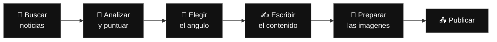
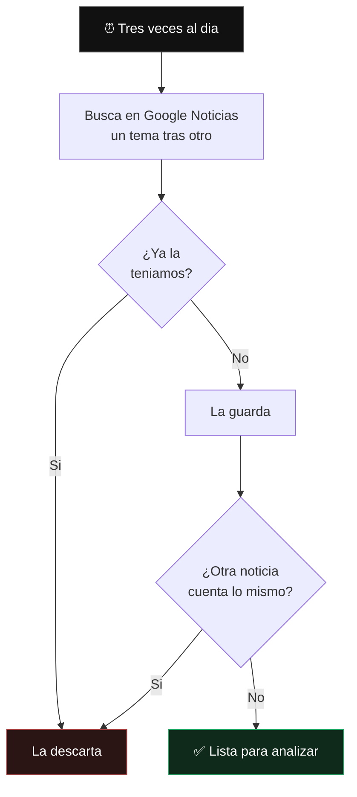
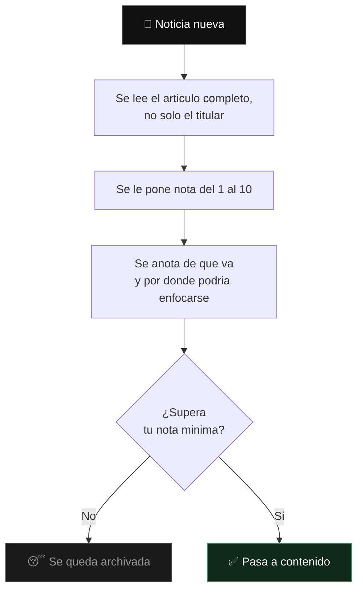
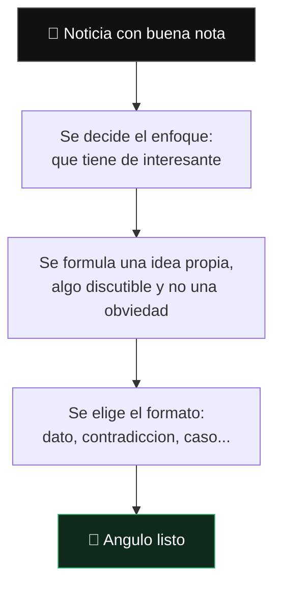
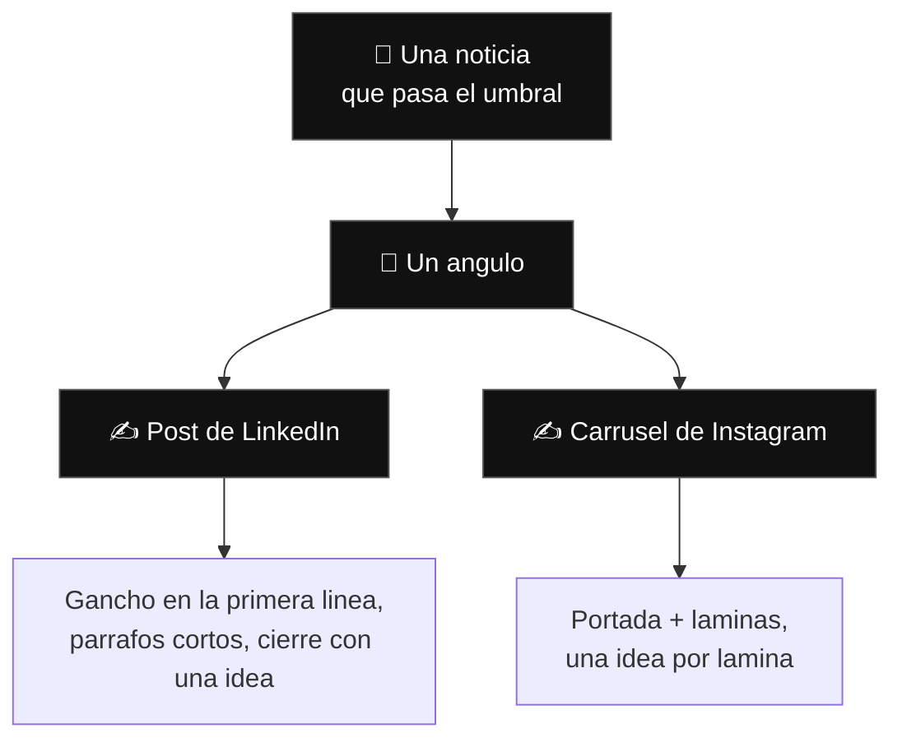
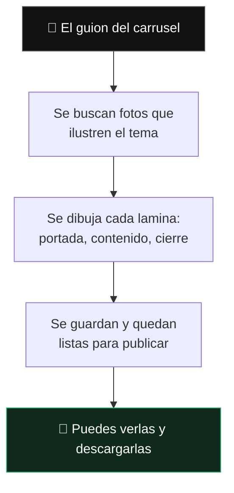
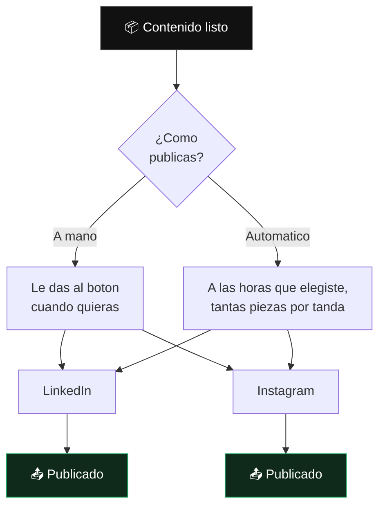
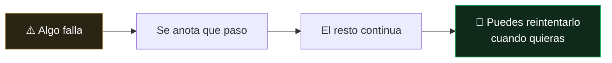

# Como funciona Hancel

Hancel lee lo que pasa en internet, decide que merece la pena contar, escribe el
contenido y lo publica. Sin que nadie tenga que estar delante.

Este documento explica el recorrido completo en lenguaje llano. No hay que saber
programar para seguirlo.

---

## El recorrido, de un vistazo

Seis pasos. Cada uno se explica abajo.

---

## 1. Buscar noticias

Tres veces al dia, Hancel sale a buscar noticias recientes sobre los temas que le
hayas dicho que le interesan.

**Los temas los eliges tu.** Se organizan en categorias (por ejemplo *IA*,
*Startups*) y dentro de cada una, temas concretos (*ciberseguridad*, *rondas de
inversion*). Se editan desde la pantalla de configuracion, sin tocar codigo.

**No se repite nada.** Dos filtros: uno descarta la misma noticia si ya la
teniamos, y otro descarta noticias distintas que cuentan el mismo hecho — algo
que pasa constantemente, porque veinte medios publican lo mismo el mismo dia.

---

## 2. Analizar y puntuar

Cada noticia nueva se lee entera y se le pone una nota del 1 al 10.

**La nota minima la pones tu.** Es el filtro que decide cuanto contenido se
produce: subirla significa publicar menos y mejor; bajarla, mas cantidad.

Nada se borra. Lo que no llega a la nota se queda guardado, y siempre puedes
mandar cualquier noticia a producir contenido tu mismo, aunque no llegue.

---

## 3. Elegir el angulo

Este es el paso que hace que el contenido no suene a nota de prensa.

Antes de escribir nada, se decide **que se va a decir** sobre la noticia: cual es
el enfoque y que afirmacion se defiende.

**Por que va aparte.** El angulo se decide **una sola vez** y de el salen el post
de LinkedIn y el carrusel de Instagram. Asi las dos redes cuentan lo mismo con
distinta forma, en vez de parecer dos contenidos que no se conocen.

> El hecho es el punto de partida, nunca el producto. Una pieza que solo repite
> lo que ya dijo el medio no aporta nada.

---

## 4. Escribir el contenido

**Una noticia produce dos publicaciones.** Del mismo angulo sale un post de
LinkedIn y un carrusel de Instagram: la misma idea contada de dos formas
distintas, no el mismo texto copiado dos veces.

**Tu eliges en que redes.** Por defecto las dos, y entonces cada noticia que
pasa el umbral genera dos publicaciones. Puedes dejar solo una —solo LinkedIn,
solo Instagram— y entonces genera una. Puedes incluso no marcar ninguna: el
sistema sigue buscando el angulo de cada noticia y lo deja preparado, y tu
decides luego que hacer con el. Se cambia desde la configuracion, y afecta solo
al modo automatico: enviar una noticia a mano sigue dejandote elegir red.

**Tu marcas el tono.** En la configuracion defines a quien le hablas, con que voz,
que quieres que haga quien lo lee y que temas evitar. Eso viaja con cada encargo,
asi que todo lo que se escribe suena a lo mismo.

Lo que **no** se hace: exageraciones tipo "revolucionario" o "cambia las reglas
del juego". Y lo que es una suposicion se presenta como suposicion, no como
hecho.

---

## 5. Preparar las imagenes

El carrusel de Instagram se convierte en imagenes reales, listas para publicar.

**Las fotos no ilustran lo obvio.** Si todas las noticias son de inteligencia
artificial, buscar fotos de "inteligencia artificial" daria siempre lo mismo:
cerebros de neon y circuitos que no dicen nada. Asi que se busca **el otro lado
del tema**: si la noticia habla de IA y abogados, se buscan abogados; si habla de
IA y comida, se busca comida.

Nunca se repite una foto dentro del mismo carrusel, y entre carruseles del mismo
tema se van alternando para que no salgan todos iguales.

**Todas las laminas no son iguales.** Hay varias composiciones —foto a pagina
completa, foto arriba con texto debajo, una frase suelta, un numero grande— y se
reparten buscando ritmo, para que el carrusel se recorra en vez de leerse como un
formulario.

**El aspecto lo controlas tu**: blanco y negro, la tipografia, si aparece tu
nombre en la esquina, y si se añade una lamina final invitando a seguir la
cuenta.

---

## 6. Publicar

**Por tandas.** Eliges a que horas se publica y cuantas piezas en cada momento.
Si no hay tantas listas, se publica lo que haya y el resto espera al siguiente
turno. Cada red va por su cuenta: puedes tener LinkedIn publicando a diario e
Instagram parado.

**Revisar es opcional.** Cada pieza se puede leer, editar, aprobar o descartar
antes de que salga. Si prefieres no revisar nada, el automatico se encarga.

---

## Que decides tu y que hace solo

| Tu decides | Hancel lo hace solo |
| --- | --- |
| Los temas que le interesan | Buscar y descartar repetidos |
| La nota minima para producir | Leer, puntuar y elegir el enfoque |
| En que redes se publica | Escribir el post y el carrusel |
| El tono, la audiencia y la voz | Adaptar la idea al formato de cada red |
| El aspecto de las imagenes | Buscar fotos y dibujar las laminas |
| Las horas y cuanto se publica | Publicar a esas horas |

---

## Cuando algo falla

Nada se pierde. Si un paso falla —una noticia sin foto, un texto que llega mal,
una red que no responde— queda anotado con el motivo y el resto sigue adelante.

Un carrusel roto no impide que se publique el post, y una noticia que falla no
detiene a las demas. Hay una pantalla donde se ve todo lo que esta en marcha,
lo que fallo y por que, con un boton para volver a intentarlo.
